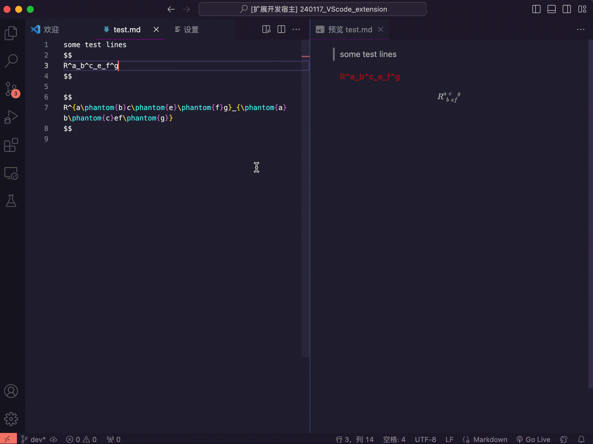

# pyrl README

**PY**thon **R**eplace **L**ine extension.

## Features

This extension serves ONE simple purpose: 
to replace a line with with a python script.

Because not all replacements can be done easiy with regular expressions.
Sometimes you might need to write some single parser and design a syntax
for replacement.

In the example, I designed a rule that can take a series of continuous
tensor superscripts and subscripts (which is not accepted in
original $LaTeX$ syntax), and gives valid $LaTeX$ code with proper 
spacing between superscripts/subscripts,
using `\phantom` grammar.

This is useful if you are to write some tensors with a pile of upper/lower indices that requires order.

## Requirements

Do make sure you have at least the followings installed:
- a [python3](https://www.python.org/) interpreter
- [nodejs](https://nodejs.org/en)

That should be enough to run this extension.

## Extension Settings

This extension contributes the following settings:

- `pyrl.scriptPath`: Specify the path to the python script.
- `pyrl.relativeToExtensionPath`: Specifies whether the script path is relative to extension path. If true, the python script will be attached to the directory of this extension. Normally, you can find the extension files under `/.vscode/extensions/`.

## Known Issues

None yet.

## Release Notes

### [0.0.1] - 2024-01-18
Initial release! 
A simple vscode extension with a simple purpose
- To replace the line where the cursor is currently at, by running a python script.